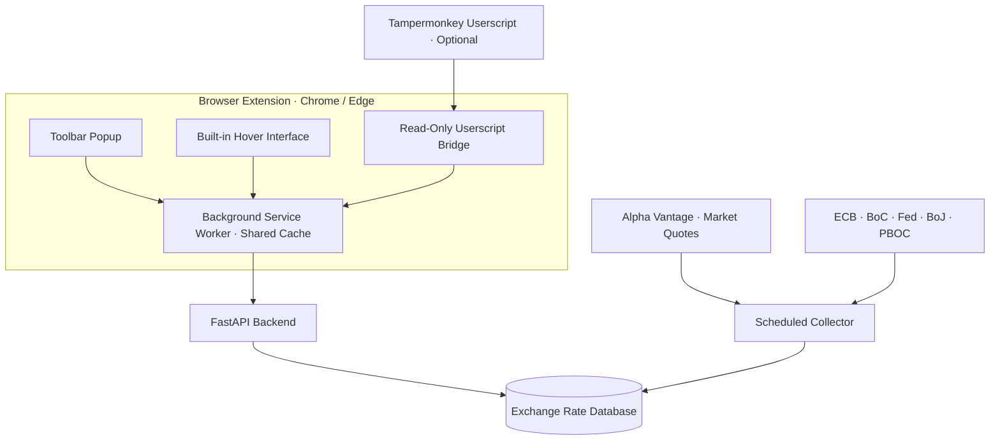

<div align="center">
  

  # FX Pulse

  **Exchange rates at a glance — live market quotes, official references, and instant webpage conversion.**

  A privacy-friendly Chrome extension powered by a self-hosted FastAPI service.

  [Quick Start](#quick-start) · [Features](#features) · [Data Sources](#data-sources) · [API](#api) · [中文简介](#中文简介)

  <p>
    <a href="https://github.com/shianjeng/FX-Pulses/actions/workflows/ci.yml"></a>
    
    
    
    
    
    <a href="LICENSE"></a>
  </p>
</div>

---

## What is FX Pulse?

FX Pulse brings a compact exchange-rate dashboard and webpage hover converter into one browser extension. It keeps **market observations** separate from **daily official reference rates**, so every number has a clear meaning and source.

The extension and hover converter share the same backend, one-minute cache, watchlist, target currency, and language preference. No Tampermonkey script is required. The optional 2.5.0 userscript also reads quotes through the extension; it no longer requests ER-API or Frankfurter or keeps a separate persistent quote cache.

> **Market midpoint** = `(bid + ask) / 2`. It is not a bank settlement rate, card-network rate, or central-bank fixing.

## Features

| | Capability | Details |
| --- | --- | --- |
| 📊 | Three-pair overview | See `USD/CNY`, `USD/JPY`, and `CNY/JPY` together |
| ↕️ | Market quote detail | Bid, ask, midpoint, spread, freshness, and 24-hour movement |
| 📈 | Interactive history | Switch between 1, 7, 30, and 90-day SVG charts |
| 🏛️ | Official references | Compare market midpoints with central-bank reference observations |
| ⚡ | Hover conversion | Point at an amount on a webpage to convert it without leaving the page |
| 🧮 | Quick converter | Choose source and target currencies, swap direction, and see the rate source and date |
| 🔔 | Optional alerts | Local target-price alerts powered by `chrome.alarms` |
| 🌐 | Three languages | Complete Chinese, English, and Japanese interfaces |
| 🔒 | Privacy first | No account, analytics SDK, or server-side storage of personal preferences |

Hover conversion is **off by default**. Enable it from Settings, grant access only to the websites you choose, and refresh those pages. If using Tampermonkey, update the script to 2.5.0 and reload webpages. To let the legacy userscript drive the data instead, also enable userscript compatibility in Settings (off by default); the native hover card then yields once per page. Otherwise, disable older scripts.

## Data sources

FX Pulse labels each data layer instead of presenting unrelated rates as if they were interchangeable.

| Layer | Source | Refresh model | Meaning |
| --- | --- | --- | --- |
| Market quotes | Alpha Vantage | Configurable; free profile defaults to four hours | Bid, ask, and arithmetic midpoint |
| Demo quotes | Built-in deterministic provider | Local | Development and interface testing only |
| Official references | European Central Bank | Daily on business days | Indicative reference observations |
| Official references | Bank of Canada | Daily on business days | Indicative reference observations |
| Official references | Federal Reserve Board | H.10 business-day release | Daily exchange-rate observations |
| Official references | Bank of Japan | Tokyo business days | USD/JPY spot rate at 17:00 JST |
| Official references | People's Bank of China | Business days | RMB central parity reference |

The popup converter discovers available currencies from `/api/v1/currencies` instead of limiting selection to the three default market pairs. It prefers direct or inverse market quotes, then selects the newest available official reference for the chosen pair. Official coverage depends on successfully collected tables; a pair requires one institution covering both currencies. Missing rates are shown explicitly. History and target alerts continue to use configured market pairs.

Official cross-rates retain their institution, reference date, fetch time, source URL, and an `is_derived` marker. They are never described as live or tradable quotes.

The PBOC source uses a website data endpoint rather than a documented statistical API. Verify all configured official sources after setup:

```dotenv
OFFICIAL_SOURCES=ecb,bank_of_canada,federal_reserve,bank_of_japan,pboc
```

```bash
cd backend
python -m app.check_official
```

## Architecture



The optional userscript sends read-only snapshot or official-pair requests through the extension bridge. The bridge never returns the backend URL, API keys, or preferences. These public quote events are visible to the host page and can be forged by page scripts; use the native extension interface on untrusted pages.

The browser never contacts upstream rate providers directly. A standalone collector validates and stores observations before the API serves them from the database. Browser requests therefore do not consume Alpha Vantage quota.

User watchlists, targets, language selection, hover preferences, and per-site currency choices stay in `chrome.storage.local`.

## Quick start

### Requirements

- Docker Desktop or Docker Engine with Compose
- Chrome or Microsoft Edge

### 1. Configure Alpha Vantage

Obtain your private key from [Alpha Vantage](https://www.alphavantage.co/support/#api-key).

```bash
cp .env.example .env
```

Edit `.env` before starting:

```dotenv
FX_PROVIDER=alpha_vantage
ALPHA_VANTAGE_API_KEY=your_private_key
```

```bash
docker compose up -d --build
```

Alpha Vantage is the default provider. A missing key prevents startup with a configuration error; there is no silent demo fallback. For explicit development without a key, set `FX_PROVIDER=mock`.

| Service | Address |
| --- | --- |
| Health check | <http://localhost:8000/health> |
| Latest rates | <http://localhost:8000/api/v1/rates> |
| Interactive API docs | <http://localhost:8000/docs> |

### 2. Load the extension

1. Open `chrome://extensions` or `edge://extensions`.
2. Enable **Developer mode**.
3. Select **Load unpacked**.
4. Choose this repository's `extension` directory.
5. Pin FX Pulse to the browser toolbar.

The default backend address is `http://localhost:8000/api/v1`. You can change it from the extension settings page.

### 3. Upgrade from 2.4.0

Keep your existing database and edit your existing `.env`; do not overwrite it with an example file. Set `FX_PROVIDER=alpha_vantage` and your own `ALPHA_VANTAGE_API_KEY`, then rebuild:

```bash
docker compose up -d --build --force-recreate
docker compose logs --tail=100 collector
```

Reload the extension in `chrome://extensions`, verify version **2.5.0**, then refresh open webpages. For the optional Tampermonkey interface, update `userscript/fx-pulse-hover.user.js` too. Enable hover and approve website access in extension settings. Without the bridge, the userscript reports unavailable data instead of contacting another provider.

Confirm that `/health` reports `"provider": "alpha_vantage"`. Its `collector` array carries one heartbeat per configured official source, so a source that quietly stopped publishing surfaces instead of hiding behind the ones that still work. Initial collection may take time; existing demo observations remain marked as mock until replaced. The userscript keeps separate appearance, target-currency and calibration preferences; only the data service is shared.

The included profile collects three pairs every four hours (18 scheduled calls/day), spaces requests by 15 seconds, and caps attempts at 25 per rolling 24-hour window. [Alpha Vantage documents a standard free limit of 25 requests/day](https://www.alphavantage.co/support/). Restarts and retries also consume attempts. Adding pairs requires adjusting the interval or using a higher-quota key. Browser refreshes do not trigger upstream collection.

Official references remain clearly labelled daily fallbacks for broader currency coverage. Unified sources does not mean all supported currencies have streaming Alpha Vantage quotes.

## API

All application endpoints are public, cached, rate-limited, and read-only.

| Method | Endpoint | Description |
| --- | --- | --- |
| `GET` | `/health` | API, provider, and per-source collector status |
| `GET` | `/api/v1/pairs` | Configured market pairs |
| `GET` | `/api/v1/currencies` | Market and official-source coverage |
| `GET` | `/api/v1/rates` | Latest cached market quotes |
| `GET` | `/api/v1/rates/{base}/{quote}` | Latest quote for one pair |
| `GET` | `/api/v1/rates/{base}/{quote}/history?days=7` | One to 90 days of history |
| `GET` | `/api/v1/official-rates` | Latest official observations |
| `GET` | `/api/v1/official-rates/{base}/{quote}` | Official observations for a covered pair |
| `GET` | `/api/v1/comparisons/{base}/{quote}` | Market and official-rate comparison |

Responses include `ETag` and `Cache-Control`. Conditional requests for unchanged data return `304`. Official endpoints can cross any pair covered by one institution's published table; market endpoints remain limited to `TRACKED_PAIRS`.

## Configuration

| Variable | Default | Purpose |
| --- | --- | --- |
| `FX_PROVIDER` | `alpha_vantage` | Choose `mock` or `alpha_vantage` |
| `ALPHA_VANTAGE_API_KEY` | empty | Private server-side provider key |
| `TRACKED_PAIRS` | `USD/CNY,USD/JPY,CNY/JPY` | Comma-separated market pairs |
| `REFRESH_INTERVAL_MINUTES` | `240` | Market collection interval |
| `PROVIDER_REQUEST_SPACING_SECONDS` | `15` | Delay between provider requests |
| `PROVIDER_DAILY_BUDGET` | `25` | Rolling 24-hour call ceiling |
| `STALE_AFTER_MINUTES` | `360` | Quote age considered stale |
| `OFFICIAL_SOURCES` | five major institutions | Enabled official providers |
| `OFFICIAL_REFRESH_INTERVAL_MINUTES` | `360` | Official-source interval |
| `RETENTION_DAYS` | `90` | Snapshot retention period |
| `RESPONSE_CACHE_SECONDS` | `60` | Read response cache duration |
| `COLLECTOR_STALL_FACTOR` | `3` | Silent intervals before a job is stalled |
| `DATABASE_URL` | SQLite locally | SQLAlchemy database URL |

## Local development

Backend:

```bash
cd backend
python -m venv .venv
source .venv/bin/activate
pip install -e ".[dev]"
# Copy ../.env.example to .env and fill in your key before continuing.
alembic upgrade head
python -m app.bootstrap
uvicorn app.main:app --reload
```

Run the collector in a second activated terminal:

```bash
cd backend
source .venv/bin/activate
python -m app.collector
```

Extension checks:

```bash
npm ci
npm run check:i18n
npm run lint
npm test
```

Backend checks:

```bash
cd backend
pytest
ruff check .
```

GitHub Actions runs migrations, backend and extension tests, linting, localization consistency checks, version consistency checks, and a Docker build on every push and pull request.

## Privacy

The page-facing userscript bridge is **off by default**. While it is enabled, any
site you allowed hover on can read cached public quote data, detect that the
extension is installed, and make the hover card stand down once per page. Enable
it only if you still run the legacy userscript. The backend address, preferences
and keys are never exposed to a page.
 and security

- API keys remain server-side and `.env` is ignored by Git.
- The extension contains no account system or analytics SDK.
- Personal preferences are not uploaded to the backend.
- Extension CORS is restricted to browser-extension origins.
- Content scripts use a constrained message gateway rather than arbitrary backend access.
- Official XML is parsed with `defusedxml`.
- Provider URLs containing credentials are excluded from normal logs.
- The Docker image runs as a non-root user.

## Data limitations

- FX Pulse provides informational data, not financial advice or an executable trading quote.
- Official observations are daily reference or indicative rates, not live prices.
- Cross-rates may combine two observations from the same institution and are marked as derived.
- Target alerts are suppressed when quotes are stale or the backend is offline.
- The free Alpha Vantage profile is periodic rather than streaming.
- Actual card, bank, brokerage, and remittance rates may include spreads and fees.

## 中文简介

FX Pulse 是一个免登录、重视隐私的汇率浏览器插件与 FastAPI 后端项目。插件可以同时查看 `USD/CNY`、`USD/JPY` 和 `CNY/JPY` 三组市场行情，也能在网页中悬停识别金额并快速换算。

项目会明确区分 Alpha Vantage 市场买卖价、市场中间价，以及欧洲央行、加拿大央行、美联储、日本银行和中国人民银行发布的官方参考价。自选列表、目标价、语言和网页权限只保存在浏览器本地；API Key 始终保留在后端。

2.5.0 默认使用 Alpha Vantage 市场数据，需在后端配置自己的 API Key。油猴 2.5.0 移除了 ER-API/Frankfurter 请求，通过已授权的插件读取同一快照及官方参考价。油猴需要插件与网页悬停权限，外观、目标币种和校准设置仍独立保存。

插件界面支持中文、English 和日本語；油猴保留原有中文界面。详细迁移和统一服务设计请参阅 [UNIFIED-SERVICE.md](docs/archive/UNIFIED-SERVICE.md)。

## License

Released under the [MIT License](LICENSE).
