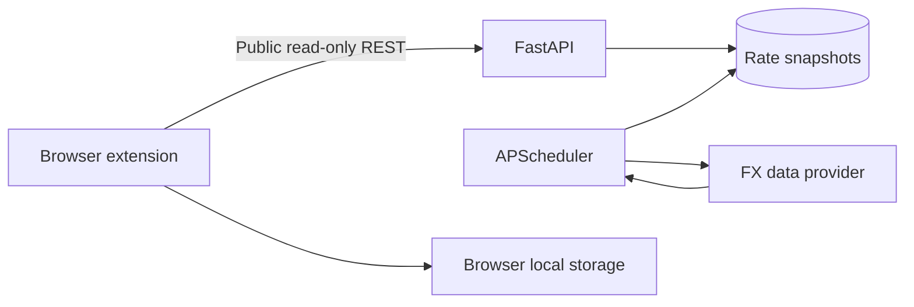

# FX Pulse

> A privacy-friendly browser extension for checking CNY, USD, and JPY market midpoints at a glance — no account required.

FX Pulse turns the browser toolbar into a compact exchange-rate dashboard. Open it to see bid, ask, midpoint, 24-hour movement, a seven-day trend, a quick converter, and locally stored target-price status. A small FastAPI service protects the upstream data key and caches shared market snapshots.


## Preview

The previous promotional render has been removed: it was not a screenshot of the
Chinese popup and mixed incompatible quote/change periods. See
[screenshot instructions](docs/SCREENSHOTS.md) to capture the actual installed
extension against the mock backend. Mock rates are synthetic, not live quotes.

## Product principles

- **Open and check:** the extension requests data only when its popup is open.
- **No login:** there are no accounts, passwords, JWTs, email addresses, or user profiles.
- **Local preferences:** the watchlist and target prices stay in `chrome.storage.local`.
- **Auditable midpoint:** the API preserves bid and ask, then calculates `(bid + ask) / 2`.
- **Honest status:** stale quotes are marked instead of being presented as live.

## Features

- Market bid, ask, midpoint, spread, and 24-hour change
- Seven-day SVG sparkline with high, low, and range position
- Currency converter with one-click direction reversal
- Local watchlist management
- Local target-price status, evaluated when the popup is opened
- One-click copy of the selected quote
- Alpha Vantage live adapter and a zero-setup deterministic demo adapter
- SQLite locally and PostgreSQL through Docker Compose
- Public read-only API with browser-extension CORS support
- Backend tests, linting, and GitHub Actions CI

## Architecture



The standalone collector collects shared market data; it never receives a user's
watchlist or target price. The extension has no service worker, alarm, email
integration, or notification permission. Clipboard write permission is used only
when copying a quote, with a selectable-text fallback if the browser rejects it.

## Quick start — Docker

Requirements: Docker Desktop or Docker Engine with Compose.

```bash
cp .env.example .env
docker compose up --build
```

Then open:

- API documentation: <http://localhost:8000/docs>
- Health check: <http://localhost:8000/health>

The default `FX_PROVIDER=mock` mode requires no external key and seeds 30 days of realistic sample history.

## Install the Chrome / Edge extension

1. Start the backend.
2. Open `chrome://extensions` in Chrome or `edge://extensions` in Edge.
3. Enable **Developer mode**.
4. Choose **Load unpacked**.
5. Select the project's `extension` directory.
6. Pin FX Pulse and click its toolbar icon.

No registration is required. The default API address is `http://localhost:8000/api/v1`. For a deployed API, open the extension settings and enter its HTTPS address.

## Local backend development

```bash
cd backend
python -m venv .venv
source .venv/bin/activate        # Windows: .venv\Scripts\activate
pip install -e ".[dev]"
uvicorn app.main:app --reload
```

Before starting the API, run `alembic upgrade head` and
`python -m app.bootstrap` inside `backend`. In a second terminal, activate the
same environment and run `python -m app.collector`.
The default database is SQLite; PostgreSQL is optional. Local environment
variables are read from `backend/.env`, while Compose reads the root `.env`.

## Use live bid/ask data

Create an Alpha Vantage API key, then update `.env`:

```dotenv
FX_PROVIDER=alpha_vantage
ALPHA_VANTAGE_API_KEY=your_key_here
```

Restart the backend afterward. The API key stays on the server and is never included in the extension bundle. Provider request limits may change, so check the provider's current quota before lowering `REFRESH_INTERVAL_MINUTES`.

## API overview

| Method | Endpoint | Purpose |
| --- | --- | --- |
| `GET` | `/health` | Health and active-provider status |
| `GET` | `/api/v1/pairs` | List supported currency pairs |
| `GET` | `/api/v1/rates` | List the latest cached quotes |
| `GET` | `/api/v1/rates/{base}/{quote}` | Read one quote |
| `GET` | `/api/v1/rates/{base}/{quote}/history?days=7` | Read 1–90 days of snapshots |

All application endpoints are read-only and require no token. Reading rates
never calls the upstream provider or spends its quota.

## Configuration

| Variable | Default | Description |
| --- | --- | --- |
| `FX_PROVIDER` | `mock` | `mock` or `alpha_vantage` |
| `ALPHA_VANTAGE_API_KEY` | empty | Server-side key for live data |
| `TRACKED_PAIRS` | `USD/CNY,USD/JPY,CNY/JPY` | Comma-separated available pairs |
| `REFRESH_INTERVAL_MINUTES` | `240` | Server-side collection interval |
| `STALE_AFTER_MINUTES` | `360` | Age at which a quote is marked stale |
| `DATABASE_URL` | SQLite | SQLAlchemy database URL |

## Quality checks

```bash
cd backend
pytest
ruff check .
```

From the project root also run `npm ci && npm run lint && npm test`.
CI runs backend and extension checks on every push and pull request.

## Operations and live-data limitations

- Run `alembic upgrade head` as a single release step before API/collector startup.
  The baseline preserves existing v2 snapshots; back up the database first.
  Old account tables are not automatically deleted.
- API workers perform no collection. Deploy exactly one collector per database.
  A file lock prevents duplicate collectors only when they share the same lock
  path/volume (as in Compose); it is not a distributed lock across independent
  hosts. Do not scale collector replicas on separate hosts.
- Collection attempts, including failures, count toward a persisted rolling
  24-hour budget. Other applications using the same key are outside this budget.
  Interval configuration is checked against the budget before startup.
- Snapshots older than `RETENTION_DAYS` (minimum 90) are deleted during collection.
- Read endpoints have a fixed-window global limit per API process. Multi-worker
  or public deployments must additionally enforce shared limits at the reverse
  proxy/gateway. The application does not trust client-supplied forwarded IPs.
- Docker runs as a non-root user. API healthcheck checks process liveness, not
  quote freshness. Monitor quote age and collector error logs separately.
- Alpha Vantage entitlement and limits depend on your plan. The public demo
  response was inspected, but your own key and the requested pairs still need
  live verification. Never assume a free key works from the demo response.
  The adapter uses the provider's `7. Time Zone`, validates bid/ask, and reports
  unavailable quotes instead of silently substituting mock data.
- Chromium/Edge are the supported extension targets. Clipboard success/denial
  are covered by DOM unit tests; actual browser permission/focus behavior
  must be checked using the manual checklist in `docs/SCREENSHOTS.md`.

## Scope and limitations

- Target prices are informational and are checked only when the popup is opened.
- Preferences do not sync between browsers or devices.
- The midpoint is a market reference, not the final rate offered by a bank, card network, or remittance service.
- Demo quotes are synthetic; use a live provider before relying on the displayed market data.

## 中文说明

FX Pulse 是一款免登录的汇率浏览器插件。点击浏览器工具栏图标后，可以查看人民币、美元和日元的买入价、卖出价、市场中间价、涨跌幅和七日走势，也可以快速换算金额、管理自选并设置本地目标价。

插件不会在后台持续轮询，也不会收集邮箱、密码、自选列表或目标价。自选与目标价只保存在当前浏览器中，并在用户打开插件时检查。后端仅负责保护第三方行情密钥、缓存公共汇率和提供历史数据。

这里的“中间价”特指市场买入价与卖出价的算术平均值，并不是中国人民银行公布的人民币汇率中间价，也不代表最终成交价。

## License

[MIT](LICENSE)
