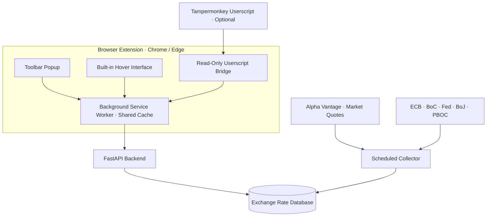

<div align="center">
  

  # FX Pulse

  **Exchange rates at a glance — live market quotes, official references, and instant webpage conversion.**

  A privacy-friendly Chrome extension that works out of the box: rates come from a free static backend on GitHub Pages, or from your own FastAPI server.

  [What's New](#whats-new-in-281) · [Quick Start](#quick-start) · [Features](#features) · [Data Sources](#data-sources) · [API](#api) · [中文简介](#中文简介)

  <p>
    <a href="https://github.com/shianjeng/FX-Pulses/actions/workflows/ci.yml"></a>
    
    
    
    
    
    <a href="LICENSE"></a>
  </p>
</div>

---

## What is FX Pulse?

FX Pulse brings a compact exchange-rate dashboard and webpage hover converter into one browser extension. It keeps **market observations** separate from **daily official reference rates**, so every number has a clear meaning and source.

The extension and hover converter share the same backend, one-minute cache, watchlist, target currency, and language preference. No Tampermonkey script is required. The optional 2.5.0 userscript also reads quotes through the extension; it no longer requests ER-API or Frankfurter or keeps a separate persistent quote cache.

> **Market midpoint** = `(bid + ask) / 2`. It is not a bank settlement rate, card-network rate, or central-bank fixing.

## What's new in 2.8.1

- **Redesigned popup.** Picking a pair, reading the rate and converting now happen in one card, with the rate as the largest element. A dark theme follows the system appearance.
- **Watchlist of any pairs.** Choose any two currencies in the picker and add them to the watchlist. Each saved pair shows its rate; select a row to switch to it.
- **Less repetition.** For a pair with only an official reference, the source is stated once instead of three times.

## What's new in 2.8.0

- **No server needed.** The extension now reads a public backend that this repository publishes to GitHub Pages every four hours. Install it and open it; rates are there. No Docker, no server, and no Alpha Vantage key.
- **Your own server still works.** The settings page now recognises both a running API and a static host, and stores which one an address is. An address you saved before 2.8.0 keeps being reached as an API; only installs that never changed the address move to the public backend.

## What's new in 2.7.0

- **Simple view by default.** The popup opens on the midpoint and the converter. Bid/ask, official references, the trend chart and target alerts are one click away under **Show details**, and your choice is remembered. The simple view does not request history or official comparisons at all, so opening the popup costs fewer calls.
- **Clearer trend chart.** One line over a soft fill, with markers only on the period high and low. The statistics below it — High, Low, Average and Change — all describe the selected range (24h, 7d, 1m or 3m). Collection outages stay visible as gaps rather than being bridged.
- **Optional static backend.** The read-only API can be exported as JSON and published on GitHub Pages by a scheduled workflow, so the extension can run without anyone operating a server. See [Static backend on GitHub Pages](#static-backend-on-github-pages).


### Rate display

Rates below 1 show at least six decimal places, with more precision for smaller values. Extremely small rates use scientific notation to avoid displaying zero. Quotes, bid/ask prices, chart values, and official references share this formatting rule. Conversion uses the unrounded stored rate; the result is rounded only for display. The converter shows the unit rate and a rounding explanation.

## Features

| | Capability | Details |
| --- | --- | --- |
| 📊 | Currency explorer | Select any two available currencies and view their rate, source and date |
| ⭐ | Watchlist | Save up to eight pairs of any currencies and switch between them in one click |
| 👁️ | Simple view | Opens on the midpoint and converter; full detail is one click away |
| ↕️ | Market quote detail | Bid, ask, midpoint, spread, freshness, and 24-hour movement (detailed view) |
| 📈 | Trend chart | 24-hour, 7-day, 1-month and 3-month lines with the period high, low, average and change |
| 🏛️ | Official references | Compare market midpoints with central-bank reference observations |
| ⚡ | Hover conversion | Point at an amount on a webpage to convert it without leaving the page |
| 🧮 | Quick converter | Choose source and target currencies, swap direction, and see the rate source and date |
| 🔔 | Optional alerts | Local target-price alerts powered by `chrome.alarms` |
| 🌐 | Three languages | Complete Chinese, English, and Japanese interfaces |
| 🌙 | Dark mode | The popup follows the system's light or dark appearance |
| 🔒 | Privacy first | No account, analytics SDK, or server-side storage of personal preferences |

Hover conversion is **off by default**. Enable it from Settings, grant access only to the websites you choose, and refresh those pages. If using Tampermonkey, update the script to 2.5.0 and reload webpages. To let the legacy userscript drive the data instead, also enable userscript compatibility in Settings (off by default); the native hover card then yields once per page. Otherwise, disable older scripts.

## Data sources

FX Pulse labels each data layer instead of presenting unrelated rates as if they were interchangeable.

| Layer | Source | Refresh model | Meaning |
| --- | --- | --- | --- |
| Market quotes | Alpha Vantage | Configurable; free profile defaults to four hours | Bid, ask, and arithmetic midpoint |
| Demo quotes | Built-in deterministic provider | Local | Development and interface testing only |
| Official references | European Central Bank | Daily on business days | Indicative reference observations |
| Official references | Bank of Canada | Daily on business days | Indicative reference observations |
| Official references | Federal Reserve Board | H.10 business-day release | Daily exchange-rate observations |
| Official references | Bank of Japan | Tokyo business days | USD/JPY spot rate at 17:00 JST |
| Official references | People's Bank of China | Business days | RMB central parity reference |

The main dashboard and converter share two currency selectors and one selected-pair card. Selecting a pair updates conversion, official comparisons, and the history panel together. Direct market quotes are preferred; reverse quotes use reciprocal prices, with bid/ask sides swapped. Market history is inverted when only the reverse pair is tracked. Pairs without market history show an explicit notice. Your last selection is saved.

The popup discovers available currencies from `/api/v1/currencies` instead of limiting selection to the three default market pairs. It prefers direct or inverse market quotes, then selects the newest available official reference for the chosen pair. Official coverage depends on successfully collected tables. A pair may use one institution or triangulate across two institutions through a shared currency; the latter retains both sources, the bridging currency, and the older reference date. Missing rates are shown explicitly. History and target alerts continue to use configured market pairs.

Official cross-rates retain their institution, reference date, fetch time, source URL, and an `is_derived` marker. They are never described as live or tradable quotes.

The PBOC source uses a website data endpoint rather than a documented statistical API. Verify all configured official sources after setup:

```dotenv
OFFICIAL_SOURCES=ecb,bank_of_canada,federal_reserve,bank_of_japan,pboc
```

```bash
cd backend
python -m app.check_official
```

## Architecture



The optional userscript sends read-only snapshot or official-pair requests through the extension bridge. The bridge never returns the backend URL, API keys, or preferences. These public quote events are visible to the host page and can be forged by page scripts; use the native extension interface on untrusted pages.

The browser never contacts upstream rate providers directly. A standalone collector validates and stores observations before the API serves them from the database. Browser requests therefore do not consume Alpha Vantage quota.

In static mode the FastAPI process is replaced by files. A scheduled GitHub Actions job runs the collector once, exports every endpoint with `python -m app.export_static`, and publishes the result to GitHub Pages. The background worker maps each API path onto its file, so the popup and hover behave identically in both modes.

User watchlists, targets, language selection, hover preferences, and per-site currency choices stay in `chrome.storage.local`.

## Quick start

FX Pulse works out of the box. The extension reads a public backend that this repository refreshes every four hours on GitHub Pages, so you do not need Docker, a server, or an API key.

### 1. Install the extension

FX Pulse is not in the Chrome Web Store yet, so it is added as an unpacked extension. It takes about a minute and works in Chrome and Microsoft Edge.

**Download**

1. [Download the ZIP](https://github.com/shianjeng/FX-Pulses/archive/refs/heads/main.zip), or click the green **Code** button on this page and choose **Download ZIP**.
2. Unzip it. You get a folder named `FX-Pulses-main`; the extension is the `extension` folder inside it.
3. Move `FX-Pulses-main` somewhere permanent, such as your Documents folder. The browser loads the extension from this folder every time, so deleting or moving it later removes the extension.

**Add it to Chrome**

1. Type `chrome://extensions` in the address bar and press Enter.
2. Turn on **Developer mode** in the top-right corner.
3. Click **Load unpacked** in the top-left corner.
4. Select the `extension` folder — the one that contains `manifest.json`, not the outer `FX-Pulses-main` folder.
5. Click the puzzle-piece icon in the toolbar and pin **FX Pulse**.
6. Click the FX Pulse icon. Rates appear immediately.

**Microsoft Edge**: go to `edge://extensions`, turn on **Developer mode** in the left sidebar, click **Load unpacked**, then follow steps 4–6.

**Updating**: download the ZIP again and replace the old `FX-Pulses-main` folder **at the same location** (or run `git pull` if you cloned it), then click the reload button ↻ on the FX Pulse card in `chrome://extensions`. Your watchlist and settings are kept. The browser identifies an unpacked extension by its folder path, so loading the new copy from a different place installs a second, empty FX Pulse instead.

**If something looks wrong**

| What you see | What to do |
| --- | --- |
| "Manifest file is missing or unreadable" | You selected the outer folder. Select `FX-Pulses-main/extension` instead. |
| A reminder to disable developer-mode extensions | Normal for extensions installed outside the Web Store. Keep FX Pulse enabled. |
| The popup says it cannot connect | Check your internet connection, then click refresh in the popup. If you changed the backend address on the settings page, enter `https://shianjeng.github.io/FX-Pulses/api/v1` there to return to the default. |
 The extension reads `https://shianjeng.github.io/FX-Pulses/api/v1`; to use your own backend instead, enter its address on the settings page.

### 2. Run your own backend (optional)

Only needed if you want your own schedule, currency pairs, or database. You need Docker Desktop or Docker Engine with Compose, and a private key from [Alpha Vantage](https://www.alphavantage.co/support/#api-key).

```bash
cp .env.example .env
```

Edit `.env` before starting:

```dotenv
FX_PROVIDER=alpha_vantage
ALPHA_VANTAGE_API_KEY=your_private_key
```

```bash
docker compose up -d --build
```

Alpha Vantage is the default provider. A missing key prevents startup with a configuration error; there is no silent demo fallback. For explicit development without a key, set `FX_PROVIDER=mock`.

| Service | Address |
| --- | --- |
| Health check | <http://localhost:8000/health> |
| Latest rates | <http://localhost:8000/api/v1/rates> |
| Interactive API docs | <http://localhost:8000/docs> |

Then open the extension's settings page and enter `http://localhost:8000/api/v1`. The page checks the backend before saving and remembers whether it is a running API or a static host.

### 3. Upgrading

**To 2.8.x**: reload the extension in `chrome://extensions` and verify version **2.8.1**. If you never changed the backend address, the extension now reads the public backend and you can stop a local stack you ran only for it. If you saved your own address, nothing changes.

**Self-hosted, from 2.6.x** no database migration is needed. Pull, rebuild, and reload the extension:

```bash
git pull
docker compose up -d --build
```

Reload the extension in `chrome://extensions` and verify version **2.8.1**. Since 2.7.0 the popup opens in the simple view; choose **Show details** once to bring back the full layout. The choice is remembered.

**From 2.5.0**, the notes below also apply. The 2.6.0 compatibility patch is based on commit `5816065` (including PR #14). It preserves the opt-in userscript bridge, per-source health checks, triangulated official rates, stale-source labels, and saved unavailable currencies.

Keep your existing database and edit your existing `.env`; do not overwrite it with an example file. Set `FX_PROVIDER=alpha_vantage` and your own `ALPHA_VANTAGE_API_KEY`, then rebuild:

```bash
docker compose up -d --build --force-recreate
docker compose logs --tail=100 collector
```

Reload the extension in `chrome://extensions`, verify version **2.8.1**, then refresh open webpages. The optional Tampermonkey interface remains compatible with `userscript/fx-pulse-hover.user.js` version 2.5.0. Enable hover, approve website access, and opt in to userscript compatibility in extension settings. Without the bridge, the userscript reports unavailable data instead of contacting another provider.

Confirm that `/health` reports `"provider": "alpha_vantage"`. Its `collector` array carries one heartbeat per configured official source, so a source that quietly stopped publishing surfaces instead of hiding behind the ones that still work. Initial collection may take time; existing demo observations remain marked as mock until replaced. The userscript keeps separate appearance, target-currency and calibration preferences; only the data service is shared.

The included profile collects three pairs every four hours (18 scheduled calls/day), spaces requests by 15 seconds, and caps attempts at 25 per rolling 24-hour window. [Alpha Vantage documents a standard free limit of 25 requests/day](https://www.alphavantage.co/support/). Restarts and retries also consume attempts. Adding pairs requires adjusting the interval or using a higher-quota key. Browser refreshes do not trigger upstream collection.

Official references remain clearly labelled daily fallbacks for broader currency coverage. Unified sources does not mean all supported currencies have streaming Alpha Vantage quotes.

## Static backend on GitHub Pages

The API is read-only and only ever returns what the collector stored, so it can be served as plain files. [`publish.yml`](.github/workflows/publish.yml) does this every four hours: it collects one round, exports the API to JSON, and deploys it to GitHub Pages. No server runs between collections, and extension users never need an Alpha Vantage key.

One-time setup in the repository:

1. **Settings → Secrets and variables → Actions**: add `ALPHA_VANTAGE_API_KEY`.
2. **Settings → Pages**: set **Source** to **GitHub Actions**.
3. Make sure no branch named `data` exists. The workflow keeps the collected history there as a single force-pushed commit, so the repository does not grow with every run.

Then run **Actions → Publish static backend → Run workflow** once. The API appears at `https://<user>.github.io/<repo>/api/v1/`.

This repository's build already points at `https://shianjeng.github.io/FX-Pulses/api/v1`. A fork publishes to its own Pages address; to ship a build that uses it, edit `extension/config.js`:

```js
globalThis.FXConfig = {
  defaultApiUrl: "https://<user>.github.io/<repo>/api/v1",
  backendMode: "static",
};
```

Add `https://<user>.github.io/*` to `host_permissions` in `extension/manifest.json`, then verify the pair:

```bash
npm run check:config
```

The check fails if the manifest does not cover the default backend, or if a non-local default uses plain HTTP. CI runs it on every push.

Time-dependent fields are never frozen into the files. `meta.json` carries collection timestamps and thresholds, and the extension decides whether a quote is stale or a collector has stalled, so a CDN serving an old file cannot make a dead collector look healthy. History is published as one 90-day file per pair and sliced in the browser.

To produce the files locally:

```bash
cd backend
python -m app.collector --once
python -m app.export_static --out ../public/api/v1
```

## API

All application endpoints are public, cached, rate-limited, and read-only.

| Method | Endpoint | Description |
| --- | --- | --- |
| `GET` | `/health` | API, provider, and per-source collector status |
| `GET` | `/api/v1/pairs` | Configured market pairs |
| `GET` | `/api/v1/currencies` | Market and official-source coverage |
| `GET` | `/api/v1/rates` | Latest cached market quotes |
| `GET` | `/api/v1/rates/{base}/{quote}` | Latest quote for one pair |
| `GET` | `/api/v1/rates/{base}/{quote}/history?days=7` | One to 90 days of history |
| `GET` | `/api/v1/official-rates` | Latest official observations |
| `GET` | `/api/v1/official-rates/{base}/{quote}` | Official observations for a covered pair |
| `GET` | `/api/v1/comparisons/{base}/{quote}` | Market and official-rate comparison |

Responses include `ETag` and `Cache-Control`. Conditional requests for unchanged data return `304`. Official endpoints can derive pairs within one published table or triangulate across two tables through a shared currency; market endpoints remain limited to `TRACKED_PAIRS`.

## Configuration

| Variable | Default | Purpose |
| --- | --- | --- |
| `FX_PROVIDER` | `alpha_vantage` | Choose `mock` or `alpha_vantage` |
| `ALPHA_VANTAGE_API_KEY` | empty | Private server-side provider key |
| `TRACKED_PAIRS` | `USD/CNY,USD/JPY,CNY/JPY` | Comma-separated market pairs |
| `REFRESH_INTERVAL_MINUTES` | `240` | Market collection interval |
| `PROVIDER_REQUEST_SPACING_SECONDS` | `15` | Delay between provider requests |
| `PROVIDER_DAILY_BUDGET` | `25` | Rolling 24-hour call ceiling |
| `STALE_AFTER_MINUTES` | `360` | Quote age considered stale |
| `OFFICIAL_SOURCES` | five major institutions | Enabled official providers |
| `OFFICIAL_REFRESH_INTERVAL_MINUTES` | `360` | Official-source interval |
| `RETENTION_DAYS` | `90` | Snapshot retention period |
| `RESPONSE_CACHE_SECONDS` | `60` | Read response cache duration |
| `COLLECTOR_STALL_FACTOR` | `3` | Silent intervals before a job is stalled |
| `DATABASE_URL` | SQLite locally | SQLAlchemy database URL |

Extension build settings live in `extension/config.js`:

| Setting | Default | Purpose |
| --- | --- | --- |
| `defaultApiUrl` | `https://shianjeng.github.io/FX-Pulses/api/v1` | Backend the extension ships with; must be covered by `host_permissions` |
| `backendMode` | `"static"` | Mode of the default backend: `"api"` for a running FastAPI service, `"static"` for exported JSON files. An address saved on the settings page carries its own detected mode |

## Local development

Backend:

```bash
cd backend
python -m venv .venv
source .venv/bin/activate
pip install -e ".[dev]"
# Copy ../.env.example to .env and fill in your key before continuing.
alembic upgrade head
python -m app.bootstrap
uvicorn app.main:app --reload
```

Run the collector in a second activated terminal:

```bash
cd backend
source .venv/bin/activate
python -m app.collector
```

Add `--once` to collect a single round and exit instead of scheduling.

Extension checks:

```bash
npm ci
npm run check:i18n
npm run check:config
npm run lint
npm test
```

Backend checks:

```bash
cd backend
pytest
ruff check .
```

GitHub Actions runs migrations, backend and extension tests, linting, localization consistency checks, version consistency checks, and a Docker build on every push and pull request. A separate scheduled workflow publishes the [static backend](#static-backend-on-github-pages).

## Privacy and security

The page-facing userscript bridge is **off by default**. While it is enabled, any
site you allowed hover on can read cached public quote data, detect that the
extension is installed, and make the hover card stand down once per page. Enable
it only if you still run the legacy userscript. The backend address, preferences
and keys are never exposed to a page.

- By default the extension fetches public files from GitHub Pages. Like any website, GitHub can see the requesting IP address; no preferences, identifiers, or page content are sent. Point the extension at your own backend to avoid this.
- API keys remain server-side and `.env` is ignored by Git.
- The extension contains no account system or analytics SDK.
- Personal preferences are not uploaded to the backend.
- Extension CORS is restricted to browser-extension origins.
- Content scripts use a constrained message gateway rather than arbitrary backend access.
- Official XML is parsed with `defusedxml`.
- Provider URLs containing credentials are excluded from normal logs.
- The Docker image runs as a non-root user.

## Data limitations

- FX Pulse provides informational data, not financial advice or an executable trading quote.
- Official observations are daily reference or indicative rates, not live prices.
- Cross-rates may combine observations from one institution or bridge two institutions; derived rates retain source and date labels.
- Target alerts are suppressed when quotes are stale or the backend is offline.
- The free Alpha Vantage profile is periodic rather than streaming.
- A static deployment is only as fresh as its last scheduled run; the popup reports a stalled collector when runs stop.
- Actual card, bank, brokerage, and remittance rates may include spreads and fees.

## 中文简介

FX Pulse 是一个免登录、重视隐私的汇率浏览器插件与 FastAPI 后端项目。插件通过两个货币选择框自由选择已覆盖的源币种和目标币种，统一查看当前汇率、官方参考价和可用走势，也能在网页中悬停识别金额并快速换算。

### 安装到浏览器

插件暂未上架 Chrome 网上应用店，需要以「已解压的扩展程序」方式添加，大约一分钟即可完成，Chrome 和 Microsoft Edge 都支持。

1. [下载 ZIP 压缩包](https://github.com/shianjeng/FX-Pulses/archive/refs/heads/main.zip)，或在本页点击绿色的 **Code** 按钮，选择 **Download ZIP**。
2. 解压后会得到 `FX-Pulses-main` 文件夹，插件就在其中的 `extension` 文件夹里。
3. 把 `FX-Pulses-main` 放到一个固定位置（例如「文稿」）。浏览器每次都从这个文件夹加载插件，之后删除或移动它，插件就会失效。
4. 在 Chrome 地址栏输入 `chrome://extensions` 并回车。
5. 打开右上角的 **开发者模式**。
6. 点击左上角的 **加载已解压的扩展程序**。
7. 选择 `extension` 文件夹（里面有 `manifest.json` 的那一层），不要选外层的 `FX-Pulses-main`。
8. 点击工具栏上的拼图图标，把 **FX Pulse** 固定到工具栏，点开即可看到汇率。

Edge 用户：打开 `edge://extensions`，在左侧打开 **开发人员模式**，点击 **加载解压缩的扩展**，然后按第 7、8 步操作。

更新：重新下载 ZIP，**在原来的位置**替换旧的 `FX-Pulses-main` 文件夹，再到 `chrome://extensions` 点击 FX Pulse 卡片上的刷新按钮 ↻，自选和设置会保留。浏览器是按文件夹路径识别这类插件的，如果换了位置重新加载，会变成另一个全新的 FX Pulse，之前的自选不会带过去。

如果提示「清单文件缺失或不可读取」，说明选成了外层文件夹，请改选 `extension` 文件夹。Chrome 提醒停用开发者模式扩展程序属于正常现象，保留 FX Pulse 即可。如果弹窗提示无法连接，先检查网络再点刷新；若曾在设置页改过后端地址，填回 `https://shianjeng.github.io/FX-Pulses/api/v1` 即可恢复默认。

### 项目说明

项目会明确区分 Alpha Vantage 市场买卖价、市场中间价，以及欧洲央行、加拿大央行、美联储、日本银行和中国人民银行发布的官方参考价。自选列表、目标价、语言和网页权限只保存在浏览器本地；API Key 始终保留在后端。

2.8.1 重新设计了弹窗界面：选币种、看汇率、换算合并在一张卡片里，并支持跟随系统的深色模式；自选可以收藏任意两种货币的组合，点一下即可切换。

2.8.0 起插件默认读取本仓库每 4 小时发布到 GitHub Pages 的公共数据，安装后打开即可使用，无需 Docker、服务器或 API Key。仍可在设置页填写自己的后端地址；2.8.0 之前保存过自定义地址的用户不受影响。默认连接 GitHub Pages 时，GitHub 能看到请求方的 IP 地址，除此之外不会发送任何偏好设置或网页内容。

2.7.0 起插件默认以简洁视图打开，只显示中间价与换算；买卖价、官方参考价、走势图和目标价提醒点击「显示详细数据」即可展开，选择会被记住。走势图改为单线加渐变填充，只标注区间最高点和最低点，下方显示所选区间的最高、最低、平均和涨跌幅。后端除了自行部署，也可以由 GitHub Actions 定时采集并导出为静态 JSON，发布到 GitHub Pages，无需常驻服务器，插件用户也不用申请 API Key。

自建后端默认使用 Alpha Vantage 市场数据，需在后端配置自己的 API Key。油猴 2.5.0 起移除了 ER-API/Frankfurter 请求，通过已授权的插件读取同一快照及官方参考价。油猴需要插件与网页悬停权限，外观、目标币种和校准设置仍独立保存。

插件界面支持中文、English 和日本語；油猴保留原有中文界面。详细迁移和统一服务设计请参阅 [UNIFIED-SERVICE.md](docs/archive/UNIFIED-SERVICE.md)。

## License

Released under the [MIT License](LICENSE).
