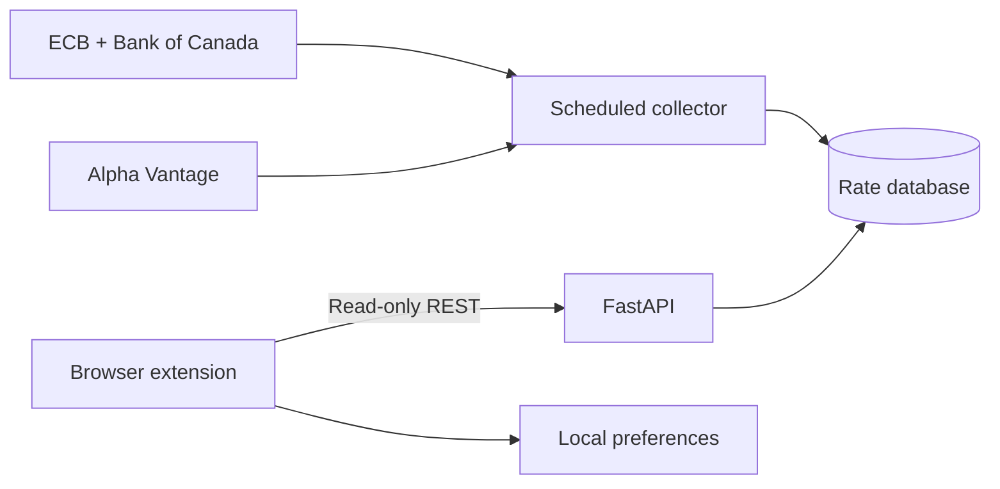

<div align="center">
  
  <h1>FX Pulse</h1>
  <p><strong>Market FX quotes and official reference rates—clearly separated, normalized, and compared.</strong></p>
  <p>A privacy-friendly browser extension backed by a production-minded FastAPI service.</p>

  <p>
    
    
    
    
    <a href="https://github.com/shianjeng/FX-Pulses/actions/workflows/ci.yml"></a>
    <a href="LICENSE"></a>
  </p>
</div>

---

## Unified extension (2.2.2)

The toolbar popup and webpage hover converter now run inside **one Chrome extension**, using the same FastAPI backend, one-minute quote cache, language and watchlist. Tampermonkey is no longer required. Hover is off by default; enable it in extension settings, grant website access, and reload the page. Disable the old userscript to prevent duplicate cards.

See [migration and architecture](UNIFIED-SERVICE.md). The installed extension never calls a separate public-rate provider: every number comes from your own backend. Where the market feed has no pair, hover offers the official daily reference rate instead, labelled as such.

FX Pulse is more than a currency converter. It combines live market bid/ask data with daily reference rates published by monetary authorities, normalizes different quotation conventions, and exposes the result through a compact browser interface and a read-only REST API.

The project currently focuses on three pairs:

- `USD/CNY`
- `USD/JPY`
- `CNY/JPY`

## Why FX Pulse?

Most exchange-rate tools display one number without explaining what it represents. FX Pulse keeps the data categories explicit:

| Data layer | What it represents | Current sources |
| --- | --- | --- |
| Market quote | Bid, ask, and arithmetic midpoint | Alpha Vantage or deterministic mock data |
| Official reference | Daily indicative/reference observation | European Central Bank and Bank of Canada |
| Comparison | Percentage difference between market midpoint and official reference | Calculated by the FX Pulse API |

The People's Bank of China central parity rate — the rate the midpoint disclaimer
refers to — can be collected as a third source by setting
`OFFICIAL_SOURCES=ecb,bank_of_canada,pboc`. It is off by default because it comes
from a website data endpoint rather than a documented statistical API; run
`python -m app.check_official` after enabling it to see exactly what was parsed.
Japan has no equivalent daily central-bank fixing, and a commercial bank's TTM
would blur the market/official split this project exists to keep, so JPY
reference observations come from the ECB and Bank of Canada tables instead.

Official observations are never presented as tradable live prices. Cross-calculated values are marked with `is_derived=true`, and every official record keeps its institution, reference date, fetch time, and source URL.

## Highlights

### Browser experience

- Market bid, ask, midpoint, spread, and 24-hour movement
- SVG trend chart over 1, 7, 30 or 90 days with interactive values
- Official reference-rate comparison for the selected pair
- Quick currency converter with direction reversal
- Local watchlist and target-price preferences
- Optional background target alerts through `chrome.alarms`, off by default
- Hover falls back to a clearly labelled official reference rate for currencies
  the market feed does not track
- One-click copy with a selectable-text fallback
- No account or analytics SDK; shared on-demand requests, no scheduled collection on hidden pages

### Backend engineering

- FastAPI read-only API with typed Pydantic responses
- SQLAlchemy persistence with Alembic migrations
- SQLite for local development and PostgreSQL through Docker Compose
- Dedicated APScheduler collector separated from API workers
- Persisted rolling provider-call budget
- Request spacing for Alpha Vantage free-key burst limits
- Provider isolation: mock and live observations never mix
- Retention cleanup, stale-data flags, CORS restrictions, and read rate limiting
- Official-source adapters store the whole published table, so any covered pair
  can be crossed without another upstream request
- Per-client sliding-window read limiting, ETag and `Cache-Control` on reads
- Collector heartbeats, so `/health` separates "stopped" from "stale"

### Quality and operations

- Backend tests with `pytest` and `pytest-asyncio`
- Extension DOM tests with Node.js and JSDOM
- Python linting with Ruff and JavaScript linting with ESLint
- `python -m app.check_official` verifies every configured official source live
- GitHub Actions CI
- Non-root Docker image and explicit migration step
- API keys remain server-side and are excluded from Git

## Architecture



The API never calls upstream providers during a browser request. One standalone collector fetches and validates shared public-rate data, then writes snapshots to the database. Watchlists and target prices remain inside `chrome.storage.local` and are never sent to the backend.

## Quick start

### Requirements

- Docker Desktop or Docker Engine with Compose
- Chrome or Microsoft Edge for the extension

### 1. Start the demo backend

```bash
cp .env.example .env
docker compose up --build
```

The default `FX_PROVIDER=mock` mode needs no API key and seeds deterministic demo history.

Once the containers are ready:

- API documentation: <http://localhost:8000/docs>
- Health check: <http://localhost:8000/health>
- Latest rates: <http://localhost:8000/api/v1/rates>

### 2. Load the extension

1. Open `chrome://extensions` or `edge://extensions`.
2. Enable **Developer mode**.
3. Select **Load unpacked**.
4. Choose the repository's `extension` directory.
5. Pin FX Pulse and open it from the browser toolbar.

The default API address is `http://localhost:8000/api/v1`. A deployed HTTPS endpoint can be configured from the extension settings page.

## Enable Alpha Vantage market data

Create a private Alpha Vantage API key, then use the prepared free-plan profile:

```bash
cp alpha-vantage.env.example .env
```

Replace only the placeholder inside `.env`:

```dotenv
ALPHA_VANTAGE_API_KEY=your_private_key
```

Then restart the stack:

```bash
docker compose down
docker compose up --build
```

The default live profile:

- refreshes three pairs every four hours;
- spaces pair requests by 15 seconds to avoid burst throttling;
- caps provider attempts at 25 per rolling 24-hour window;
- suppresses request-URL logging so API keys do not appear in collector logs.

Alpha Vantage returns a real-time observation when queried, but the free profile is not a continuous streaming feed. Do not reduce the refresh interval unless the key has a verified higher quota.

## API

| Method | Endpoint | Description |
| --- | --- | --- |
| `GET` | `/health` | Service status and configured market provider |
| `GET` | `/api/v1/pairs` | Tracked currency pairs |
| `GET` | `/api/v1/currencies` | Tracked pairs plus official-only currencies |
| `GET` | `/api/v1/rates` | Latest cached market quotes |
| `GET` | `/api/v1/rates/{base}/{quote}` | Latest quote for one pair |
| `GET` | `/api/v1/rates/{base}/{quote}/history?days=7` | One to 90 days of market history |
| `GET` | `/api/v1/official-rates` | Latest normalized official observations |
| `GET` | `/api/v1/official-rates/{base}/{quote}` | Official observations for any covered pair |
| `GET` | `/api/v1/comparisons/{base}/{quote}` | Market midpoint and official-rate comparison |

All application endpoints are public and read-only. Reading cached rates never spends upstream API quota.
Responses carry an `ETag`; a conditional request for unchanged data is answered with `304`.

`/health` also reports each collector job's last success, consecutive failures and
whether it has gone silent for several collection intervals. Only the collector
status degrades there — `status` stays `ok` while the API itself is serving.

Official endpoints are not limited to `TRACKED_PAIRS`: the ECB and Bank of Canada
tables cover roughly thirty currencies each, and any pair within one table can be
crossed. Market endpoints remain limited to the configured pairs.

## Local development

```bash
cd backend
python -m venv .venv
source .venv/bin/activate
pip install -e ".[dev]"
alembic upgrade head
python -m app.bootstrap
uvicorn app.main:app --reload
```

Run the collector in a second activated terminal:

```bash
cd backend
python -m app.collector
```

## Tests and linting

Backend:

```bash
cd backend
pytest
ruff check .
```

Extension:

```bash
npm ci
npm test
npm run lint
```

CI runs the backend suite, migrations, the extension suite, ESLint, a version
consistency check and a Docker build on every push and pull request.

## Configuration

| Variable | Default | Purpose |
| --- | --- | --- |
| `FX_PROVIDER` | `mock` | Select `mock` or `alpha_vantage` market data |
| `ALPHA_VANTAGE_API_KEY` | empty | Private server-side provider key |
| `TRACKED_PAIRS` | `USD/CNY,USD/JPY,CNY/JPY` | Comma-separated tracked pairs |
| `REFRESH_INTERVAL_MINUTES` | `240` | Market collection interval |
| `PROVIDER_REQUEST_SPACING_SECONDS` | `15` | Delay between live pair requests |
| `PROVIDER_DAILY_BUDGET` | `25` | Rolling 24-hour provider-call ceiling |
| `STALE_AFTER_MINUTES` | `360` | Age at which a market quote becomes stale |
| `OFFICIAL_REFRESH_INTERVAL_MINUTES` | `360` | Official-source collection interval |
| `RETENTION_DAYS` | `90` | Snapshot retention period |
| `RESPONSE_CACHE_SECONDS` | `60` | `Cache-Control: max-age` on read endpoints |
| `COLLECTOR_STALL_FACTOR` | `3` | Silent intervals before a job counts as stalled |
| `TRUST_FORWARDED_FOR` | `false` | Read client IPs from `X-Forwarded-For` |
| `DATABASE_URL` | SQLite | SQLAlchemy database connection URL |

## Privacy and security

- No user accounts, authentication database, or personal profiles
- No server-side storage of watchlists or target prices
- No API key in the extension bundle
- `.env` is ignored by Git
- Extension CORS is restricted to browser-extension origins
- Provider URLs containing credentials are not emitted at normal log levels
- Public endpoints are read-only and protected by a per-client sliding-window limit
- Content scripts may only read one official cross rate through the gateway; every
  other API path is reachable from extension pages alone
- Official XML is parsed with `defusedxml`

## Data limitations

- A market midpoint is `(bid + ask) / 2`; it is not a bank, card-network, or remittance settlement rate.
- ECB and Bank of Canada observations are daily reference/indicative rates, not tradable quotes.
- Cross-rates may combine two observations from the same institution and are explicitly marked as derived.
- Target prices are informational. They are checked when the popup is opened and,
  if background alerts are enabled, on a timer that only reads already-cached
  backend data. Alerts are suppressed for stale or offline quotes.
- Official reference rates shown by hover are daily observations, never live quotes.
- The included free Alpha Vantage profile refreshes periodically rather than continuously.

## 中文简介

FX Pulse 是一个免登录的汇率浏览器插件与 FastAPI 后端项目。它同时展示市场买卖价、中间价以及欧洲央行、加拿大央行发布的官方参考汇率，并统一不同机构的报价口径，计算市场中间价与官方参考价之间的偏差。

自选列表和目标价只保存在浏览器本地；后端只负责保护行情 API Key、定时采集公共汇率、保存历史快照并提供只读接口。官方参考价、交叉推算价和实时市场行情会被明确区分，避免把不同性质的数据混为一谈。

## License

Released under the [MIT License](LICENSE).
